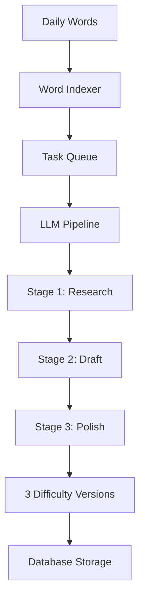

import { Aside, Steps } from '@astrojs/starlight/components';

UpWord uses a sophisticated multi-stage LLM pipeline to generate articles at three difficulty levels (Easy, Medium, Hard) from daily vocabulary words.

## Pipeline Overview



## Core Components

| Component | File | Description |
|-----------|------|-------------|
| **Pipeline Orchestrator** | `server/src/services/llm/pipeline.ts` | Coordinates the generation stages |
| **Prompts** | `server/src/services/llm/prompts.ts` | System and user prompts for each stage |
| **Analyzer** | `server/src/services/llm/analyzer.ts` | Content analysis and validation |
| **LLM Client** | `server/src/services/llm/client.ts` | Unified interface for providers |
| **Providers** | `server/src/services/llm/providers/` | Gemini, OpenAI, Claude adapters |

## Generation Stages

<Steps>

1. **Word Fetching**

   The system fetches today's vocabulary from the word source (e.g., Shanbay API) via `dailyWords.ts`.

   ```typescript
   // server/src/services/dailyWords.ts
   const words = await fetchDailyWords();
   ```

2. **Task Queuing**

   A generation task is created and added to the queue for background processing.

   ```typescript
   // server/src/services/tasks/queue.ts
   queue.add({ type: 'generate', words, date: today });
   ```

3. **Stage 1: Research**

   The LLM researches current events and finds a suitable topic that can naturally incorporate the vocabulary.

   - Uses web search capability (if available)
   - Identifies newsworthy angles
   - Plans vocabulary integration

4. **Stage 2: Draft Generation**

   Creates three article drafts at different difficulty levels:

   | Level | Target Audience | Characteristics |
   |-------|-----------------|-----------------|
   | **Easy** | Beginners | Simple sentences, common words, ~300 words |
   | **Medium** | Intermediate | Varied structure, some idioms, ~400 words |
   | **Hard** | Advanced | Complex grammar, nuanced vocabulary, ~500 words |

5. **Stage 3: Polish & Analyze**

   The `analyzer.ts` module processes each draft:
   - Validates JSON schema compliance
   - Extracts syntax annotations
   - Generates IPA pronunciations
   - Creates summary metadata

</Steps>

## Prompt Engineering

Prompts are defined in `server/src/services/llm/prompts.ts` with strict requirements:

<Aside type="caution">
  **Non-negotiable rules:**
  - All vocabulary words MUST appear in each difficulty version
  - Output MUST be valid JSON matching the defined schema
  - Each article MUST cover the same core topic
</Aside>

### Output Schema

```typescript
interface ArticleOutput {
  title: string;
  content: string;        // HTML formatted
  syntaxJson: SyntaxData; // Grammar annotations
  summary: string;
  wordUsages: {
    word: string;
    sentence: string;
    definition: string;
  }[];
}
```

## Error Handling

The pipeline follows a **fail-fast** approach:

- **JSON Parse Failures**: Task terminates immediately
- **Missing Words**: Generation rejected
- **API Errors**: Retry with exponential backoff (max 3 attempts)

```typescript
// Validation example
if (!validateSchema(output)) {
  throw new AppError('JSON_VALIDATION_FAILED', 'LLM output does not match schema');
}
```

## Provider Configuration

Configure your LLM provider in `.env`:

```bash
LLM_PROVIDER=gemini  # Options: gemini, openai, claude
GEMINI_API_KEY=your-key
GEMINI_MODEL=gemini-2.0-flash-thinking-exp
```

See [Environment Variables](/guides/env-vars/) for complete provider options.

## Extending the Pipeline

To add a new LLM provider:

1. Create a new file in `server/src/services/llm/providers/`
2. Implement the `LLMProvider` interface:

   ```typescript
   interface LLMProvider {
     generate(prompt: string, options: GenerateOptions): Promise<string>;
     supportsWebSearch(): boolean;
   }
   ```

3. Register the provider in `client.ts`
