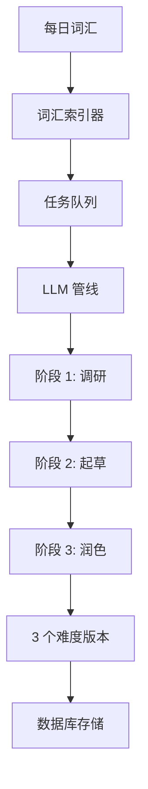

import { Aside, Steps } from '@astrojs/starlight/components';

UpWord 使用复杂的多阶段 LLM 管线，根据每日词汇生成三个难度级别（简单、中等、困难）的文章。

## 管线概览



## 核心组件

| 组件 | 文件 | 说明 |
|------|------|------|
| **管线编排器** | `server/src/services/llm/pipeline.ts` | 协调生成各阶段 |
| **Prompts** | `server/src/services/llm/prompts.ts` | 各阶段的系统和用户提示词 |
| **分析器** | `server/src/services/llm/analyzer.ts` | 内容分析与验证 |
| **LLM 客户端** | `server/src/services/llm/client.ts` | 统一的提供商接口 |
| **提供商** | `server/src/services/llm/providers/` | Gemini、OpenAI、Claude 适配器 |

## 生成阶段

<Steps>

1. **获取词汇**

   系统通过 `dailyWords.ts` 从词汇来源（如扇贝 API）获取今日词汇。

   ```typescript
   // server/src/services/dailyWords.ts
   const words = await fetchDailyWords();
   ```

2. **任务入队**

   创建生成任务并添加到队列进行后台处理。

   ```typescript
   // server/src/services/tasks/queue.ts
   queue.add({ type: 'generate', words, date: today });
   ```

3. **阶段 1: 调研**

   LLM 研究时事新闻，找到能自然融入词汇的合适主题。

   - 使用联网搜索能力（如支持）
   - 识别新闻热点角度
   - 规划词汇融入方案

4. **阶段 2: 起草生成**

   创建三个不同难度级别的文章草稿：

   | 级别 | 目标读者 | 特征 |
   |------|----------|------|
   | **简单** | 初学者 | 简单句式、常用词汇、约 300 词 |
   | **中等** | 中级学习者 | 多样句式、部分俚语、约 400 词 |
   | **困难** | 高级学习者 | 复杂语法、精准词汇、约 500 词 |

5. **阶段 3: 润色分析**

   `analyzer.ts` 模块处理每篇草稿：
   - 验证 JSON Schema 合规性
   - 提取语法注解
   - 生成 IPA 音标
   - 创建摘要元数据

</Steps>

## Prompt 工程

Prompts 定义于 `server/src/services/llm/prompts.ts`，包含严格要求：

<Aside type="caution">
  **不可妥协的规则：**
  - 所有词汇必须出现在每个难度版本中
  - 输出必须是符合定义 Schema 的有效 JSON
  - 每篇文章必须覆盖相同的核心主题
</Aside>

### 输出 Schema

```typescript
interface ArticleOutput {
  title: string;
  content: string;        // HTML 格式
  syntaxJson: SyntaxData; // 语法注解
  summary: string;
  wordUsages: {
    word: string;
    sentence: string;
    definition: string;
  }[];
}
```

## 错误处理

管线遵循 **快速失败** 策略：

- **JSON 解析失败**：任务立即终止
- **缺失词汇**：拒绝生成结果
- **API 错误**：指数退避重试（最多 3 次）

```typescript
// 验证示例
if (!validateSchema(output)) {
  throw new AppError('JSON_VALIDATION_FAILED', 'LLM 输出不符合 Schema');
}
```

## 提供商配置

在 `.env` 中配置 LLM 提供商：

```bash
LLM_PROVIDER=gemini  # 可选: gemini, openai, claude
GEMINI_API_KEY=your-key
GEMINI_MODEL=gemini-2.0-flash-thinking-exp
```

完整提供商选项请参阅 [环境变量配置](/zh-cn/guides/env-vars/)。

## 扩展管线

添加新的 LLM 提供商：

1. 在 `server/src/services/llm/providers/` 创建新文件
2. 实现 `LLMProvider` 接口：

   ```typescript
   interface LLMProvider {
     generate(prompt: string, options: GenerateOptions): Promise<string>;
     supportsWebSearch(): boolean;
   }
   ```

3. 在 `client.ts` 中注册提供商
